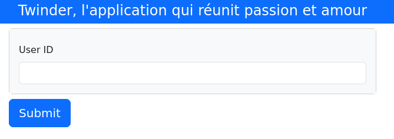
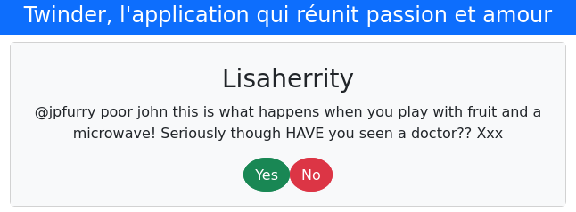

# Project of the coding weeks 2023 of the Twinder® Team

## GitLab and pwpt

https://docs.google.com/presentation/d/1eBpYBZ3qCNge3yiuCJ5f1ER0wrEK_rBEQPP6JIsN4SA/edit#slide=id.gc6f9e470d_0_0

## Description

Create a programm that proposes some Twitter profiles to the user from its tweets.



> You first type in your username...



> ...and then like or pass on the proposed profiles.

## The Twinder® Team

- Anas Lecaillon : Development of the torch Models, cleaning of their datasets (topic.csv, emotion.csv),
training of the models, testing, cleaning of the text with lemmatizations, optimizations of many bits of code,
organization of code/module structure.
- Mohamed Koucha : Page to submit a result, Style, Themes and tests of the pages
- Balthazar : TextBlob classifier implementation for polarity (pos, neu, neg), training of the classifier, 
            combination of the classifier, the emotion model and the topic model to create each user's metric,
            calculating closest users, testing, and a little of dataframe cleaning, and create the metric dataframe
- Léna Pohier--Plantel: Tests and global problems, create the metric dataframe
- Sarah Pouliquen : Conception of the user choosing interface. Refined the design of the interface using a css file.
- Martin Pupat : Frontend-backend connection, Code optimization, Team coordination

## Dependencies

### Run Dependencies

- `dash`
- `dash_bootstrap_components`
- `pandas`
- `numpy`

#### Project Run Setup     

1. Install dependencies
```bash
pip3 install dash dash_bootstrap_components numpy pandas
```

3. Clone the repository
```bash
git clone https://gitlab-cw4.centralesupelec.fr:twittos/twittos-s1.git
```

### Development Dependencies

- `dash`
- `dash_bootstrap_components`
- `autocorrect`
- `nltk`
- `numpy`
- `pandas`
- `pytorch_lightning`
- `spacy`
- `torch`
- `torchtext`
- `wandb`

#### Project Development Setup     

1. Install dependencies
```bash
pip3 install dash dash_bootstrap_components autocorrect nltk numpy pandas torch pytorch_lightning spacy torchtext wandb
```

2. Download vocabularies
```bash
python3 -m spacy download en
```

3. Clone the repository
```bash
git clone https://gitlab-cw4.centralesupelec.fr:twittos/twittos-s1.git
```

4. Download stopwords and other nltk components:
```bash
python3 config.py
```

# To run the project

Execute the `__main__.py` file or simply go into the root directory of the repository
and type

```bash
python3 .
```

## Username examples to test the app:

scotthamilton, mimismo, erinx3leannexo, 2Hood4Hollywood, joy_wolf, lovesongwriter

## Troubleshooting

If files in dumps missing, use the `data_handling`'s `create_dataframe.py` methods
to recreate them


## Current Project Structure
```
twinder
├── app
│   ├── app.py
│   └── cookie.txt
├── classifiers
│   ├── cleaner.py
│   ├── nlp_models.py
│   └── textblob_classifier.py
├── config.py
├── data_handling
│   └── create_dataframe.py
├── dumps
│   ├── check_topic.py
│   ├── cl_data.obj
│   ├── df.pkl
│   ├── emotion.csv
│   ├── emotion_lemmatized.pkl
│   ├── emotion_model.ckpt
│   ├── emotion.pkl
│   ├── emotion.vocab
│   ├── font.ttf
│   ├── metrics.csv
│   ├── metrics.pkl
│   ├── topic.csv
│   ├── topic_model.ckpt
│   ├── topic.pkl
│   ├── topic.vocab
│   ├── tweet_emotions.csv
│   ├── tweets.csv
│   └── tweets.pkl
├── images
│   ├── logo_non_transparent.png
│   ├── logo_transparent.png
│   ├── twinder-1.png
│   └── twinder-2.png
├── __main__.py
├── metrics_handlers
│   ├── metrics.py
│   └── models.py
├── model_notebooks
│   ├── emotion_train.ipynb
│   └── topic_train.ipynb
├── README.md
├── tests
│   ├── emotion_classifier.py
│   ├── __init__.py
│   ├── test_classifier.py
│   ├── test_emotion_classifier.py
│   ├── test_metrics.py
│   ├── test_text_analysis.py
│   ├── test_with_pytest.py
│   └── topic_classifier.py
└── Working docs
    └── WhatsApp_Image_2023-11-23_at_10.32.55.jpeg
```

## Informations about tests

## MVP progression

- Conception of the first interface where the user can enter its id and load the associated dataframe generated in backend using the dash module from python.
- Design of the second page enabling the selection of pretendant lovers by also using the dash module from python.

## MVC


## What else could we have done if the Coding Weeks were longer ?

- Limitations of the database : geolocalisation, if all users are active (date of the last tweet)
- Work on the classifier models
- Limitations of the API, instead add an implementation fonctionnality : an user can upload its tweets and get the compatibility with all the users in the database and is added to the database
- adaptive metric depending on the choice previously made by the user
- if the following system is taken into account, add it to the metric system
